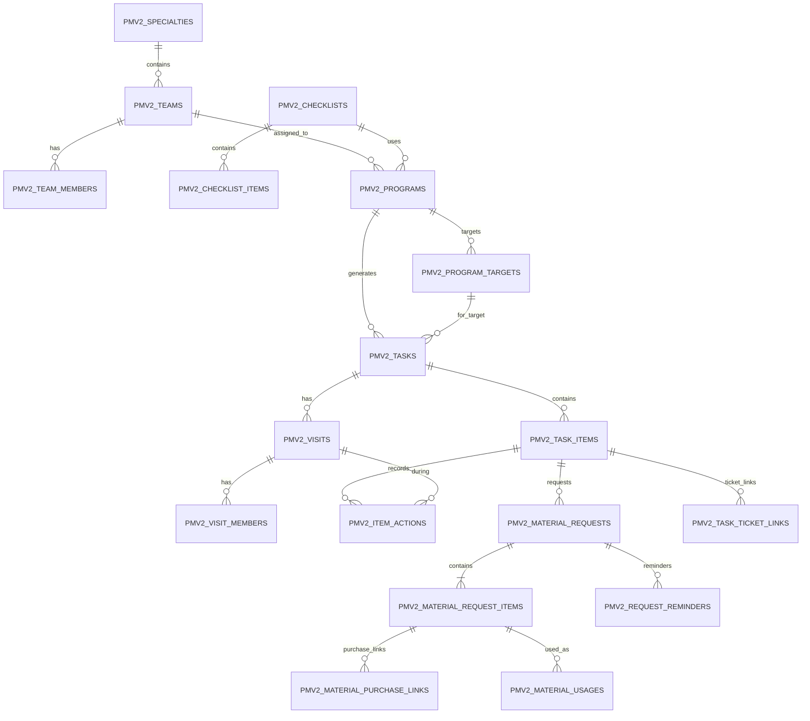

# PM V2 — Final ERD Freeze — Phase 0

> **الحالة:** FROZEN — 2026-09-06  
> **التنفيذ:** التصميم نفسه ما زال FROZEN. بدأ التنفيذ التدريجي في Phase 1 بتاريخ 2026-09-07؛ DB Steps 1–5 نُفذت يدويًا بنجاح. DDL لـDB Step 5 ظهر معه تحذير TiDB بسبب تعطيل `CHECK`، ثم تم التحقق من البنية الفعلية بـ`SHOW CREATE TABLE` واعتماد Service Validation للنطاقات؛ DB Step 5 = PASS. بقية الجداول تُطبق SQL خطوة بخطوة دون تغيير الـERD المجمد.  
> **القاعدة:** PM V2 تملك بياناتها فقط، وتستخدم Master Data والـWorkflows الحالية عبر Adapters دون تكرارها أو فرض قيود DB قد تغير سلوكها.

## 1. حدود الملكية النهائية

### جداول تملكها PM V2

1. `pmv2_specialties`
2. `pmv2_teams`
3. `pmv2_team_members`
4. `pmv2_checklists`
5. `pmv2_checklist_items`
6. `pmv2_programs`
7. `pmv2_program_targets`
8. `pmv2_tasks`
9. `pmv2_task_items`
10. `pmv2_visits`
11. `pmv2_visit_members`
12. `pmv2_item_actions`
13. `pmv2_material_requests`
14. `pmv2_material_request_items`
15. `pmv2_material_purchase_links`
16. `pmv2_task_ticket_links`
17. `pmv2_material_usages`
18. `pmv2_request_reminders`

### جداول حالية لا تكررها PM V2

- `users`
- `sites`
- `sections`
- `assets`
- `warehouses`
- `catalog_items`
- `inventory`
- `inventory_lots`
- `inventory_transactions`
- `tickets` / `ticket_items`
- `purchase_orders` / `purchase_order_items`
- Purchase Packages والجداول الحالية الأخرى التابعة للشراء/المخزون/البلاغات.

## 2. سياسة العلاقات والـFK — FROZEN

### داخل PM V2

العلاقات بين جداول `pmv2_*` تستخدم FKs فعلية وIndexes مناسبة في المرحلة 1 — تأسيس الوحدة وربط البيانات الأساسية.

- لا Cascade Delete على البيانات التشغيلية أو التاريخية.
- الكيانات المرجعية مثل Specialty/Team/Checklist/Program تستخدم `isActive` بدل حذف تاريخ مستخدم.
- حذف/تعطيل Parent لا يمحو Tasks/Visits/Material Requests التاريخية.

**TiDB implementation note — 2026-09-08:** الـERD المنطقي يحتفظ بالـDomain constraints، لكن `CHECK` ليست enforcement mechanism معتمدة في البيئة الحالية لأن `tidb_enable_check_constraint` = OFF. لذلك Range/flag invariants تُفرض في PM V2 service write boundary مع Tests، دون تغيير الإعداد GLOBAL. هذا لا يغير cardinality أو ownership أو logical constraints المجمدة.

### إلى الجداول الحالية

مراجع مثل `users.id`, `sites.id`, `warehouses.id`, `tickets.id`, `purchase_orders.id` هي **External References منطقية**:

- نفس نوع ID الحقيقي (`int` حسب Reality Checks الحالية للمراجع التي تم فحصها).
- Indexed داخل PM V2 عند الحاجة.
- يتم Validation عبر Adapter قبل الحفظ/الانتقال.
- **لا يفرض PM V2 Physical FK إلى جدول حالي إذا كان ذلك قد يمنع Delete/Workflow قائم أو يغير سلوك الوحدة المالكة.**
- Snapshot fields تحفظ فقط ما يلزم للتاريخ/العرض، ولا تتحول إلى Master Data موازية.

هذه السياسة تحافظ على استقلال الوحدة وتمنع PM V2 من فرض Side Effects على Workflows الحالية.

## 3. ERD المنطقي النهائي

External links are intentionally not drawn as owned tables: Program Targets reference Site/Section/Asset; Teams reference Warehouses/Users; Purchase Links reference PO/PO Item; Ticket Links reference Ticket; Material Usage references current Inventory transactions/Lots.

## 4. Organization ERD — FROZEN

### `pmv2_specialties`

- `id` PK.
- `code` UNIQUE.
- `managerUserId` nullable external reference → `users.id`.
- `isActive`.
- audit timestamps/creator.

### `pmv2_teams`

- `id` PK.
- `specialtyId` NOT NULL internal FK → `pmv2_specialties.id`.
- `code` UNIQUE.
- `warehouseId` NOT NULL external reference → `warehouses.id`.
- `deviceUserId` nullable external reference → `users.id`.
- `isActive`.

Cardinality: Specialty `1 → N` Teams.

### `pmv2_team_members`

- `id` PK.
- `teamId` NOT NULL internal FK.
- `userId` NOT NULL external reference → `users.id`.
- `isActive`, `joinedAt`, `leftAt`.
- UNIQUE `(teamId, userId)`؛ إعادة التفعيل تعيد استخدام نفس Membership row بدل Duplicate history row.

Cardinality: Team `1 → N` Members.

## 5. Checklist / Recurrence — FROZEN

### `pmv2_checklists`

Reusable template.

### `pmv2_checklist_items`

- `checklistId` internal FK.
- ترتيب/Required/Title.
- Recurrence **تظل على مستوى Checklist Item نفسه**؛ لا ينشأ Recurrence Master موازٍ في Baseline ERD.
- الحقول الحالية: frequency + frequencyValue/weekday/monthDay/anchorDate حسب نوع التكرار.

Cardinality: Checklist `1 → N` Items.

## 6. Program / Target — FROZEN

### `pmv2_programs`

- `teamId` NOT NULL internal FK → `pmv2_teams.id`.
- `checklistId` NOT NULL internal FK → `pmv2_checklists.id`.
- Program واحد له Team واحد واضح في Baseline.

### `pmv2_program_targets`

- `programId` NOT NULL internal FK.
- `siteId` nullable external ref.
- `sectionId` nullable external ref.
- `assetId` nullable external ref.
- Exactly One من الثلاثة فقط.
- لا تخزن Parent IDs المشتقة.
- تمنع Duplicate Target من نفس النوع داخل نفس Program.

Cardinality: Program `1 → N` Targets.

## 7. Task / Task Item — FROZEN

### `pmv2_tasks`

- `programId` NOT NULL internal FK.
- `programTargetId` NOT NULL internal FK → `pmv2_program_targets.id`.
- `teamId` NOT NULL internal FK كSnapshot assignment تشغيلي وقت التوليد.
- `taskNumber` UNIQUE.
- `dueDate`.
- `status` يخزن كـ**Cached Domain Projection** لتسريع قوائم العمل، لكنه لا يملك Transitions مستقلة؛ يعاد حسابه من Task Items بواسطة PM V2 Domain Service، باستثناء `cancelled` الإداري والإغلاق النهائي.
- UNIQUE `(programId, programTargetId, dueDate)` كحاجز Idempotency أساسي للـScheduler.

Cardinality: Program Target `1 → N` Tasks.

### `pmv2_task_items`

- `taskId` NOT NULL internal FK.
- `sourceChecklistItemId` NOT NULL internal FK.
- Snapshot title/order/scheduledDate.
- `status` و`result` حسب State Machine المجمدة.
- UNIQUE `(taskId, sourceChecklistItemId, scheduledDate)` لمنع Duplicate generation داخل Task نفسها.

Cardinality: Task `1 → N` Task Items.

## 8. Visits / Actions — FROZEN

- Task `1 → N` Visits.
- Visit `1 → N` Members.
- Task Item `1 → N` Item Actions.
- Item Action ينتمي إلى Visit محددة عند التنفيذ.
- Visit لا يغلق Task تلقائيًا.
- Leader/Member Users هي External References إلى `users`.

## 9. Material Request ERD — FROZEN

### `pmv2_material_requests`

الـHeader **لا يخزن Status مستقلًا** في Baseline ERD.

- `id` PK.
- `taskItemId` NOT NULL internal FK → `pmv2_task_items.id`.
- `visitId` NOT NULL internal FK → `pmv2_visits.id`.
- `requestedById` external ref → `users.id`.
- `teamId` internal FK → `pmv2_teams.id`.
- `teamWarehouseId` external ref → `warehouses.id` كSnapshot للمخزن المقصود وقت الطلب.
- timestamps.

Cardinality:

- Task Item `1 → 0..N` Material Requests؛ يسمح بطلب جديد لاحقًا لنفس البند دون تغيير الطلب التاريخي السابق.
- Material Request ينشأ فقط عند `needs_material` وبعد عدم توفر المادة المطلوبة في مخزن الفريق وفق Contract المجمد.

### `pmv2_material_request_items`

- `requestId` NOT NULL internal FK.
- `catalogItemId` nullable external ref → `catalog_items.id`.
- `itemNameSnapshot` NOT NULL.
- `requestedQuantity` NOT NULL > 0.
- `unitSnapshot` nullable.
- `status` حسب State Machine المجمدة.
- `receivedWarehouseQuantity` default 0 كProjection من الاستلام الخارجي المؤكد.
- `issuedToTeamQuantity` default 0 كProjection من Warehouse Transfer المؤكد.
- لا `receivedInventoryLotId` مفرد في الـItem؛ قد توجد عدة Lots/Transactions، لذلك Lot/Transaction trace يبقى في السجلات التشغيلية/Usage والأنظمة الحالية بدل حقل واحد مضلل.

Cardinality: Material Request `1 → 1..N` Items.

قواعد الكمية:

- لا Partial Status enum.
- يمكن أن تتغير الكميات التجميعية جزئيًا بينما يبقى Status في حالة الانتظار المناسبة.
- `issued_to_team` لا يتحقق إلا عندما `issuedToTeamQuantity >= requestedQuantity`.
- `consumed` لا يتحقق إلا بعد وجود Material Usage فعلية تكفي Contract الإصلاح؛ Usage هي Source of Truth للاستهلاك.

## 10. PM V2 Purchase Link — FROZEN

الاسم النهائي:

`pmv2_material_purchase_links`

الحقول الأساسية:

- `id` PK.
- `materialRequestItemId` NOT NULL internal FK → `pmv2_material_request_items.id`.
- `purchaseOrderId` NOT NULL external reference → `purchase_orders.id`.
- `purchaseOrderItemId` NOT NULL external reference → `purchase_order_items.id`.
- `linkedQuantity` NOT NULL > 0.
- `createdById` external reference → `users.id`.
- `createdAt`.

Cardinality المجمدة:

- Material Request Item `1 → 0..N` Purchase Links؛ يسمح بتقسيم الاحتياج على أكثر من PO/PO Item إذا احتاج الواقع ذلك.
- كل Purchase Link يشير إلى PO Item محدد؛ لا Header-only tracking.
- `purchaseOrderItemId` يكون UNIQUE داخل هذا الجدول في Baseline: PO Item واحد لا يمثل مصدر PM V2 متعددًا بصورة غامضة.
- UNIQUE `(materialRequestItemId, purchaseOrderItemId)` كحماية إضافية.
- Purchase Adapter يتحقق أن `purchaseOrderItemId` تابع فعليًا لـ`purchaseOrderId`.
- مجموع `linkedQuantity` لنفس Material Request Item لا يتجاوز الكمية المطلوبة إلا بإجراء تعديل طلب مصرح ومدقق.

لا تخزن PM V2 حالة الـPO؛ تقرأها من Purchase Workflow الحالي.

## 11. PM V2 Task ↔ Ticket Link — FROZEN

الاسم النهائي:

`pmv2_task_ticket_links`

الحقول الأساسية:

- `id` PK.
- `taskItemId` NOT NULL internal FK → `pmv2_task_items.id`.
- `ticketId` NOT NULL external reference → `tickets.id`.
- `createdById` external reference → `users.id`.
- `createdAt`.

لا نخزن `taskId` داخل الرابط لأنه مشتق بلا غموض من `taskItemId`، وبذلك نتجنب Duplicate source IDs أو mismatch.

Cardinality المجمدة:

- Task Item `1 → 0..N` Ticket Links تاريخيًا؛ يمكن إنشاء بلاغ متابعة جديد لاحقًا إذا لزم بعد إغلاق السابق.
- `ticketId` UNIQUE داخل Link table؛ Ticket واحد له PM V2 Source واحد واضح.
- Domain rule: لا يسمح بأكثر من Ticket مفتوح فعّال لنفس Task Item في الوقت نفسه إلا بقرار صريح مستقبلي؛ هذا يتحقق عبر Ticket Adapter لأن حالة Ticket مملوكة للنظام الحالي.
- PM V2 لا تخزن `maintenancePath` ولا Ticket status كSource of Truth.

## 12. Material Usage — FROZEN

`pmv2_material_usages` هو Trace/Audit لاستهلاك مادة أثناء الإصلاح، وليس Stock ledger.

- يرتبط بـTask Item + Visit.
- `materialRequestItemId` nullable: يكون موجودًا عندما جاء الاستخدام من طلب مادة PM V2، ويبقى nullable عندما كانت المادة متوفرة أصلًا في مخزن الفريق ولم ينشأ Material Request.
- يحتفظ بالمراجع الخارجية اللازمة مثل Warehouse/Catalog/Inventory Transaction/Lot/Delivery/PO Item حسب ما تعيده الخدمة الحالية.
- كمية الاستخدام > 0.
- PM V2 لا تنقص Stock مباشرة.

## 13. Closure / Source of Truth — FROZEN

- Task Items هي Source of Truth للحالة التشغيلية داخل PM V2.
- Task status ملخص Cached Projection منها.
- Material Request Header ملخص مشتق؛ Items هي Source of Truth.
- PO status مملوك لـPurchase Workflow الحالي.
- Ticket status وA/B/C مملوكة لـTicket Workflow الحالي.
- Inventory balance/transactions/lots مملوكة لنظام المخزون الحالي.
- PM V2 links تحفظ **سبب/مصدر العلاقة** ولا تنسخ Workflow خارجيًا.

## 14. ما لا يدخل في ERD

لا جداول جديدة لـ:

- Departments.
- Locations بديلة.
- Users/Technicians بدلاء.
- Team Stock.
- Purchase Workflow أو PO status history.
- Ticket A/B/C workflow/state.
- Purchase Package source.

## 15. قيود التنفيذ في المرحلة 1

عند بدء المرحلة 1 لاحقًا:

1. لا ينفذ المساعد DB write مباشرة.
2. SQL يرسل للمستخدم خطوة بخطوة.
3. Internal PM V2 FKs/Unique/Checks تطبق يدويًا بعد مراجعة SQL.
4. External references تستخدم Adapter validation وIndexes حسب هذا Freeze.
5. أي اختلاف Schema حي يظهر أثناء SQL generation يوقف تلك الخطوة فقط ويعاد Reality Check قبل تعديل الـERD المجمد.
6. تغيير Cardinality أو Ownership أو Source-of-Truth الوارد هنا يعتبر **Design Change** ويحتاج قرارًا موثقًا، وليس Implementation Detail.

## 16. Phase 0 ERD Freeze Gate — PASS

- [x] PM V2-owned tables محددة.
- [x] Master Data الحالية غير مكررة.
- [x] Program Target cardinality مجمدة.
- [x] Task → Program Target relation مجمدة.
- [x] Scheduler idempotency uniqueness مجمدة.
- [x] Material Request Header/Items cardinality مجمدة.
- [x] Material Request Header status = derived، وليس Workflow مكررًا.
- [x] Purchase Link name/cardinality/constraints مجمدة.
- [x] Task↔Ticket Link name/cardinality/constraints مجمدة.
- [x] External reference policy مجمدة لمنع التأثير على Workflows الحالية.
- [x] Source-of-Truth boundaries مجمدة.

**النتيجة:** ERD Freeze النهائي مكتمل/FROZEN. بعد Documentation Consistency Review نجح **Phase 0 Acceptance Gate** وأصبحت Phase 0 **CLOSED/PASS**. المرحلة 1 — تأسيس الوحدة وربط البيانات الأساسية — هي المرحلة التالية ولم تبدأ بعد.
